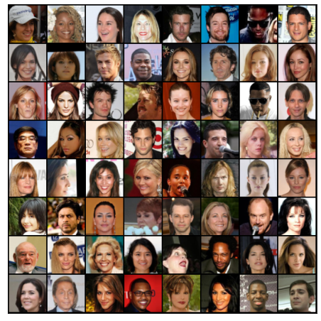
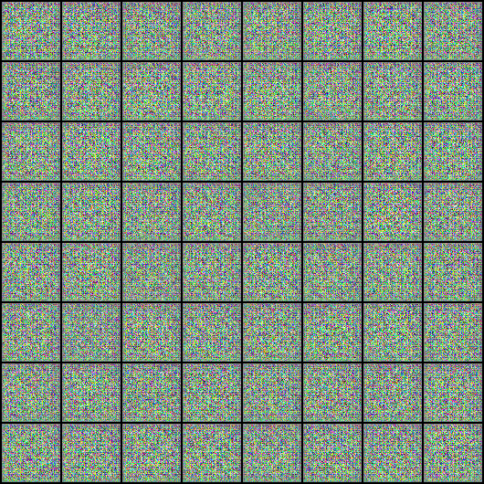
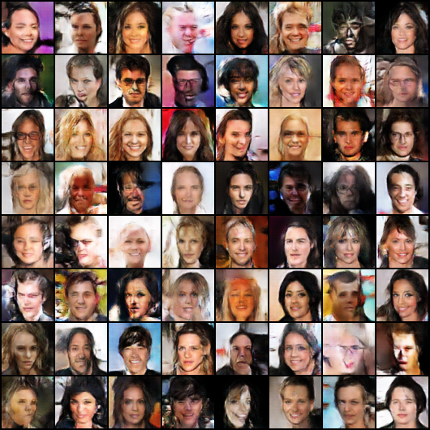
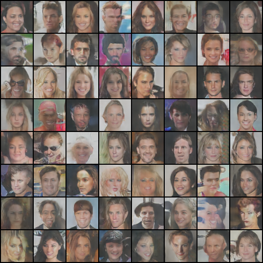
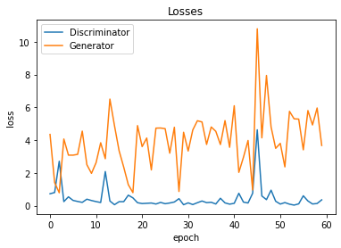
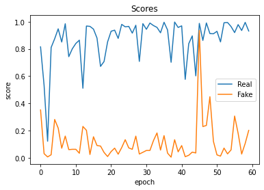

# Data_Augmentation_GANs

As of now, all of the data augmentation methods that we are aware of focus on ways to create new, synthetic data out of the existing data. 
Data augmentations are used nearly universally in computer vision applications to obtain more training data and improve model generalisation. 


The primary techniques employed are:

* rotation, 
* cropping, 
* noise injection, 
* flipping, 
* zooming, and many other techniques. 

These changes are made in real time in computer vision utilising data generators. A batch of data is randomly altered (augmented) when it is fed into your neural network. Before training, there is nothing you need to prepare.

The model is going to be taught to assess various approaches like as cropping, flipping, zooming, and so on. It will get training to undo these augmentations, and 
to your neural network it is randomly transformed (augmented). You don’t need to prepare anything before training.

The model will be trained to analyse the cropping, flipping, zooming and etc.. techniques. It will be trained to reverse these augmentations done and perceive the picture.

However, what if we added to the current dataset by selecting characteristics from other pictures and producing fresh ones for training? The models will have fresh characteristics—more precisely, new picture details—to work with and hone.

Our goal with this repository is to generate new images (augment dataset) using GANs (generative adversarial networks) from the current dataset.

Seems intriguing? We'll see!

## Getting Started
To get started with this project, follow the code snippets and detailed code is mentioned in the notebook in this repositor
#### **Setting Up the Dataset and Environment**: 

##### **Dataset:** https://www.kaggle.com/datasets/greg115/celebrities-100k

This section of the code provides essential steps for setting the dataset directory, specifying image size and batch size, creating a data loader with image transformations, and defining functions for denormalization and device handling. These preparations are crucial for subsequent machine learning tasks and model training.
```python3
# Define image size, batch size, and image statistics for normalization
image_size = 64
batch_size = 128
stats = (0.5, 0.5, 0.5), (0.5, 0.5, 0.5)  # Mean and standard deviation for image normalization

# Create a training dataset with transformations
train_ds = ImageFolder(root=Image_directories, 
                       transform=T.Compose([T.Resize(image_size),
                                            T.CenterCrop(image_size),  # Crop the center square of the image
                                            T.ToTensor(),
                                            T.Normalize(*stats)  # Normalize images to the range -1 to 1
                                        ]))


# Create a data loader for training
train_data = DataLoader(train_ds, batch_size, shuffle=True, num_workers=3, pin_memory=True)  # Utilize multiple CPU cores
```

#### **Sneak Peek:**
A quick look at the generated images by the Generator even before training begins.


#### **Meet the Discriminator:**
The code introduces the architecture of the Discriminator network, which critically evaluates generated images.
```python3
discriminator = nn.Sequential(
    # in: 3x 64 x 64
    nn.Conv2d(3, 64, kernel_size=4, stride=2, padding=1, bias=False),
    nn.BatchNorm2d(64),
    nn.LeakyReLU(0.2, inplace=True),
    # out: 64 x 32 x 32

    nn.Conv2d(64, 128, kernel_size=4, stride=2, padding=1, bias=False),
    nn.BatchNorm2d(128),
    nn.LeakyReLU(0.2, inplace=True),
    # out: 128 x 16 x 16

    nn.Conv2d(128, 256, kernel_size=4, stride=2, padding=1, bias=False),
    nn.BatchNorm2d(256),
    nn.LeakyReLU(0.2, inplace=True),
    # out: 256 x 8 x 8

    nn.Conv2d(256, 512, kernel_size=4, stride=2, padding=1, bias=False),
    nn.BatchNorm2d(512),
    nn.LeakyReLU(0.2, inplace=True),
    # out: 512 x 4 x 4

    nn.Conv2d(512, 1, kernel_size=4, stride=1, padding=0, bias=False),
    # out: 1 x 1 x 1

    nn.Flatten(),
    nn.Sigmoid()
)
```

#### **Meet the Generator:**
The code reveals the Generator's architecture, responsible for creating beautiful artwork.


```python3
generator = nn.Sequential(
    # in: latent_size x 1 x 1

    nn.ConvTranspose2d(latent_size, 512, kernel_size=4, stride=1, padding=0, bias=False),
    nn.BatchNorm2d(512),
    nn.ReLU(True),
    # out: 512 x 4 x 4

    nn.ConvTranspose2d(512, 256, kernel_size=4, stride=2, padding=1, bias=False),
    nn.BatchNorm2d(256),
    nn.ReLU(True),
    # out: 256 x 8 x 8

    nn.ConvTranspose2d(256, 128, kernel_size=4, stride=2, padding=1, bias=False),
    nn.BatchNorm2d(128),
    nn.ReLU(True),
    # out: 128 x 16 x 16

    nn.ConvTranspose2d(128, 64, kernel_size=4, stride=2, padding=1, bias=False),
    nn.BatchNorm2d(64),
    nn.ReLU(True),
    # out: 64 x 32 x 32

    nn.ConvTranspose2d(64, 3, kernel_size=4, stride=2, padding=1, bias=False),
    nn.Tanh()  # output is between -1 to 1
    # out: 3 x 64 x 64
)
```
## **The Artful Journey**

#### **Training the Generator:**
Learn how the Artful Creator refines its skills to generate images that "fool" the Discriminator.
#### **The Training Loop:**
Discover the process where art meets truth, with both the Discriminator and Generator honing their abilities.

```python3
def train_discriminator(real_images, opt_d):
  # Clear discriminator gradients
  opt_d.zero_grad()

  # Pass real images through  discriminator
  real_preds = discriminator(real_images)
  real_targets = torch.ones(real_images.size(0), 1, device=device)
  real_loss = F.binary_cross_entropy(real_preds, real_targets)
  real_score = torch.mean(real_preds).item()

  # Generate fake images
  latent = torch.randn(batch_size, latent_size, 1, 1, device=device)
  fake_images = generator(latent)

  # Pass Fake images through discriminator
  fake_targets = torch.zeros(fake_images.size(0), 1, device=device)
  fake_preds = discriminator(fake_images)
  fake_loss = F.binary_cross_entropy(fake_preds, fake_targets)
  fake_score = torch.mean(fake_preds).item()

  # Update discriminator weights
  loss = real_loss + fake_loss
  loss.backward()
  opt_d.step()
  return loss.item(), real_score, fake_score
```

```python3
def train_generator(opt_g):
  # Clear generator gradients
  opt_g.zero_grad()

  # Generate fake images
  latent = torch.randn(batch_size, latent_size, 1,1, device=device)
  fake_images = generator(latent)

  # Try to fool the discriminator
  preds = discriminator(fake_images)
  targets = torch.ones(batch_size, 1, device=device)
  loss = F.binary_cross_entropy(preds, targets)

  # Update generator 
  loss.backward()
  opt_g.step()

  return loss.item()
```

### Fitting the dataset to generator and discrimator training networks
```python3
def fit(epochs, lr, start_idx = 1):
  torch.cuda.empty_cache()

  # Losses & scores
  losses_g = []
  losses_d = []
  real_scores = []
  fake_scores = []

  # Create optimizers
  opt_d = torch.optim.Adam(discriminator.parameters(), lr=lr, betas=(0.5, 0.999))
  opt_g = torch.optim.Adam(generator.parameters(), lr=lr, betas=(0.5, 0.999))

  for epoch in range(epochs):
    for real_images, _ in tqdm(train_dl):
      # Train discriminator
      loss_d, real_score, fake_score = train_discriminator(real_images, opt_d)
      # Train generator
      loss_g = train_generator(opt_g)

    # Record losses & scores
    losses_g.append(loss_g)
    losses_d.append(loss_d)
    real_scores.append(real_score)
    fake_scores.append(fake_score)

    # Log losses & scores (last batch)
    print("Epoch [{}/{}], loss_g: {:.4f}, loss_d: {:.4f}, real_score: {:.4f}, fake_score: {:.4f}".format(epoch+1, epochs, loss_g, loss_d, real_score, fake_score))
    # Save generated images
    save_samples(epoch+start_idx, fixed_latent, show=False)

  return losses_g, losses_d, real_scores, fake_scores
```
## Saving Masterpieces
The code provides functionality to save the masterpieces generated by the Generator during training, allowing you to witness the artistic evolution.

```python3
def save_samples(index, latent_tensors, show=True):
  fake_images = generator(latent_tensors)
  fake_fname = 'generated=images-{0:0=4d}.png'.format(index)
  save_image(denorm(fake_images), os.path.join(sample_dir, fake_fname), nrow=8)
  print("Saving", fake_fname)

  if show:
    fig, ax = plt.subplots(figsize=(8,8))
    ax.set_xticks([]); ax.set_yticks([])
    ax.imshow(make_grid(fake_images.cpu().detach(), nrow=8).permute(1, 2, 0))
```  

## Visualization and Export
The code shows how to visualize losses and scores during training, helping you understand the training process.
Export the generated images and even create a video to visualize the progress of the model.

```python3
import cv2
import os

vid_fname = 'gans_training.avi'

print("Starting converting images to video.")
files = [os.path.join(sample_dir, f) for f in os.listdir(sample_dir) if 'generated' in f]
files.sort()

print(files)

fourcc = cv2.VideoWriter_fourcc(*'MPEG')
out = cv2.VideoWriter(vid_fname,fourcc, 1.0, (640,480))
[out.write(cv2.imread(fname)) for fname in files]
out.release()
print("DONE!")
```
### **In the beginning**
 

### **Through the way**
 

### **Almost to the end**
##### **It can be way better too...**

```python3
plt.plot(losses_d, '-')
plt.plot(losses_g, '-')
plt.xlabel('epoch')
plt.ylabel('loss')
plt.legend(['Discriminator', 'Generator'])
plt.title('Losses');
```
 

```python3
plt.plot(real_scores, '-')
plt.plot(fake_scores, '-')
plt.xlabel('epoch')
plt.ylabel('score')
plt.legend(['Real', 'Fake'])
plt.title('Scores');
```

### References
1) @article{goodfellow2014generative,
  title={Generative adversarial nets},
  author={Goodfellow, Ian and Pouget-Abadie, Jean and Mirza, Mehdi and Xu, Bing and Warde-Farley, David and Ozair, Sherjil and Courville, Aaron and Bengio, Yoshua},
  journal={Advances in neural information processing systems},
  volume={27},
  pages={2672--2680},
  year={2014}
}
2) **Title:** GAN Beginner Tutorial on CelebA Dataset
**Author:** Sushant Kumar
**Repository URL:** https://www.kaggle.com/code/sushant097/gan-beginner-tutorial-on-celeba-dataset


